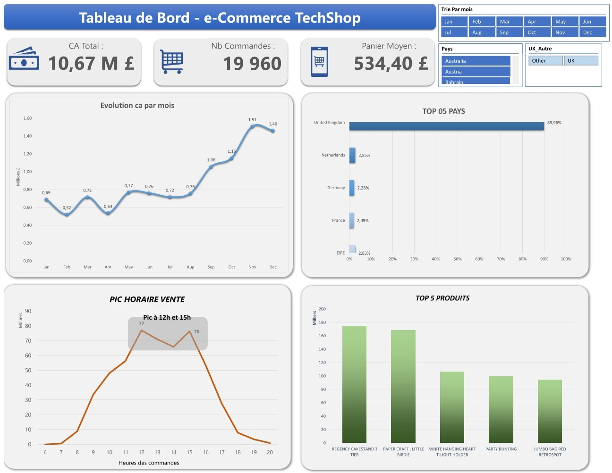

# Projet 2 – Analyse de ventes e-commerce (Excel + Power Query + Power Pivot)

## 🎯 Objectif

Analyser les données de ventes d'un site e-commerce (TechShop) pour identifier les tendances business et optimiser la stratégie commerciale.

---

## 📊 Contexte

**Client fictif :** TechShop (e-commerce spécialisé dans les articles de cuisine/décoration)  
**Dataset :** 541 910 transactions sur 13 mois (déc. 2010 - déc. 2011)  
**Source :** [UCI Machine Learning - Online Retail Dataset](https://www.kaggle.com/datasets/carrie1/ecommerce-data)

---

## 🔧 Outils utilisés

- **Excel** : Tableaux Croisés Dynamiques, visualisations
- **Power Query** : Nettoyage et transformation des données (541k lignes)
- **Power Pivot** : Mesures DAX pour KPIs avancés

---

## 🧹 Traitement des données

### Problèmes identifiés :

1. **Format de dates** : Dates en format US (MM/JJ/AAAA) → Conversion avec paramètres régionaux
2. **Prix à 0** : 4 523 lignes supprimées (erreurs système)
3. **Quantités négatives** : 10 624 retours/annulations exclus de l'analyse
4. **CustomerID vides** : 135k lignes (clients non identifiés) → Remplacés par "Guest"

### Colonne créée :

Total_Vente = Quantity \* UnitPrice

**Résultat final :** 397 884 transactions valides analysées

---

## 📈 Questions Business & Réponses

### 1. **Quel est le mois record ?**

**Réponse :** Novembre 2011 avec **1,51M £** de CA  
**Insight :** Effet Black Friday + préparation Noël. Février 2011 est le plus faible (0,50M £) : creux post-fêtes classique.

### 2. **Dans quelle zone géographique vend-on le plus ?**

**Réponse :**

- 🥇 **United Kingdom** : 89,96% du CA total (marché domestique)
- 🥈 **Netherlands** : 2,85%
- 🥉 **EIRE (Irlande)** : 2,83%

**Insight :** Dépendance forte au marché UK. Opportunité d'expansion en Europe continentale.

### 3. **À quelle heure maximiser les campagnes marketing ?**

**Réponse :** Pics à **12h** (77 commandes/h) et **15h** (76 commandes/h)  
**Insight :** Achats pendant les pauses bureau. Recommandation : Envoi newsletter à 11h45 pour capter la pause déjeuner.

### 4. **Quels sont les produits stars ?**

**Top 5 produits par CA :**

1. **REGENCY CAKESTAND 3 TIER** : 181k £
2. **PAPER CRAFT, LITTLE BIRDIE** : 168k £
3. **WHITE HANGING HEART T-LIGHT HOLDER** : 108k £
4. **PARTY BUNTING** : 100k £
5. **JUMBO BAG RED RETROSPOT** : 97k £

**Insight :** Les articles de décoration "vintage" dominent. Suggérer mise en avant sur la page d'accueil.

---

## 📊 Dashboard Excel

**Composants :**

- 3 KPIs principaux (CA Total, Nb Commandes, Panier Moyen)
- Évolution mensuelle du CA (Courbe)
- Top 5 Pays (Barres horizontales + %)
- Pic horaire de commandes (Courbe)
- Top 5 Produits par CA (Histogramme)
- Segments interactifs (Mois, Pays)

---

## 🎓 Compétences démontrées

✅ Nettoyage de gros volumes de données (500k+ lignes)  
✅ Gestion des formats internationaux (dates US/FR)  
✅ Création de mesures DAX (Power Pivot)  
✅ Analyse multi-dimensionnelle (Temps, Géo, Produit)  
✅ Data storytelling (Recommandations actionnables)  
✅ Design de dashboards professionnels

---

## 📁 Fichiers

- `analyses/TechShop_Analyse_Ventes.xlsx` : Fichier Excel complet (Power Query + Power Pivot + Dashboard)
- `dashboard/tableau-de-bord-eCommerce.jpg` : Capture du dashboard final

---

## 🚀 Recommandations business

1. **Marketing :** Lancer les campagnes promo à 11h45 (pic 12h).
2. **Expansion :** Tester l'Allemagne et la France (proximité géographique du UK).
3. **Merchandising :** Mettre en avant le "Regency Cakestand" sur la homepage.
4. **Fidélisation :** Cibler les 135k clients "Guest" avec un programme de création de compte.
5. **Saisonnalité :** Anticiper les stocks pour Novembre (×3 vs février).

---

## 📅 Date de réalisation

Décembre 2025 - Janvier 2026

---

**[⬅️ Retour au portfolio](../README.md)**
